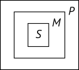

## Дедуктивные умозаключения
### Понятие об умозаключении

_Умозаключение_ — это такое логическое действие, посредством которого из двух или нескольких суждений мы получаем новое суждение.

Умозаключения бывают _дедуктивные_, когда мысль идёт от общего к частному, и _индуктивные_, когда мысль идёт от частного к общему.

### Определение силлогизма

_Силлогизм_, или _дедуктивное умозаключение_ — это такое умозаключение, в котором из двух данных суждений выводится третье суждение, причём одно из данных суждений — непременно общее.

Если силлогизм состоит из категорических суждений, то он называется _категорическим силлогизмом_.

### Состав силлогизма

В состав силлогизма входят _посылки_ (или предпосылки) и _заключение_ (или вывод).

Терминами называются понятия, которые входят в состав посылок и заключений.

Терминов всего три: меньший термин (_S_), больший термин (_P_) и средний термин (_M_).

Меньший термин — это подлежащее заключения.

Больший термин — это сказуемое заключения.

Названия «меньший» и «больший» возникли потому, что сказуемое обычно бывает больше по объёму, чем подлежащее.

Средний термин обозначает то понятие, которое содержится в посылках и связывает их между собой, но в состав заключения не входит.

Та посылка, в состав которой входит больший термин, называется большей посылкой; та посылка в состав которой входит меньший термин, называется меньшей посылкой.

### Вопросы

- Умозаключение — форма или действие?
